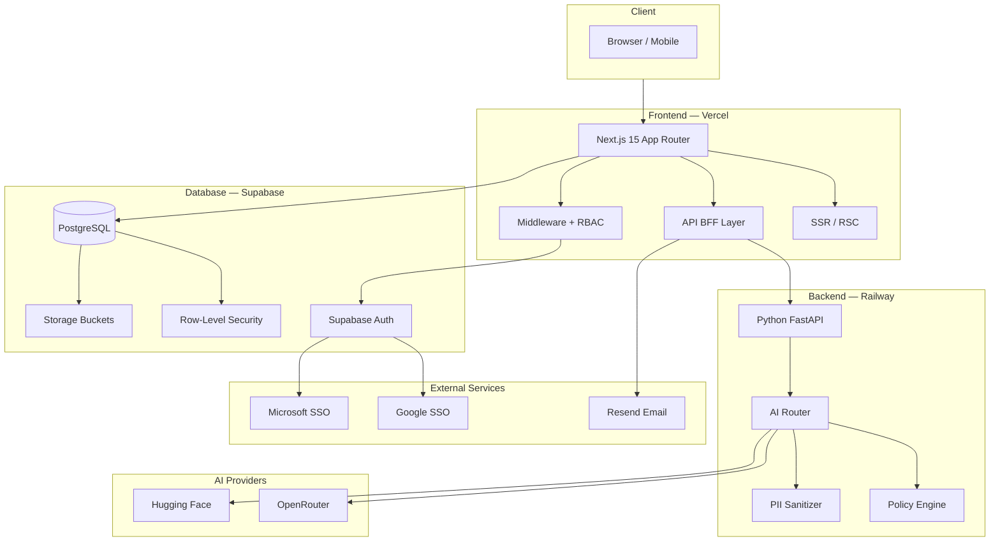
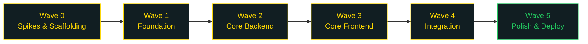
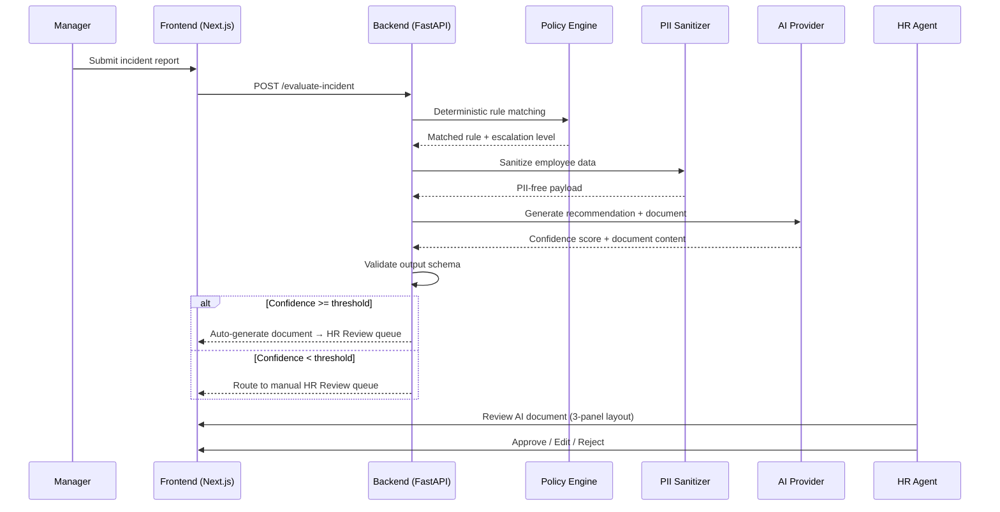
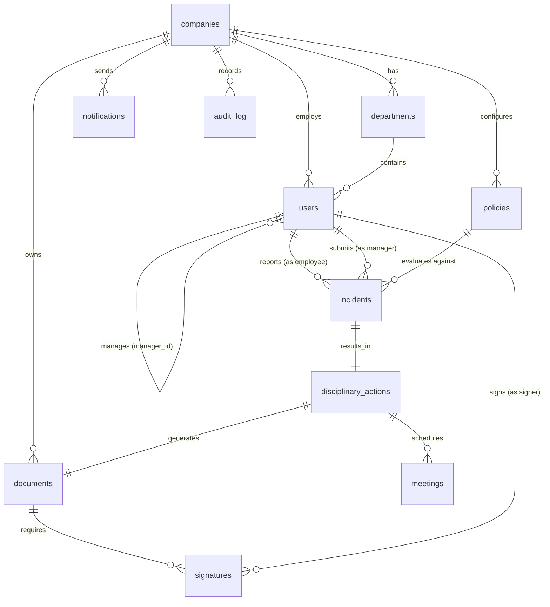
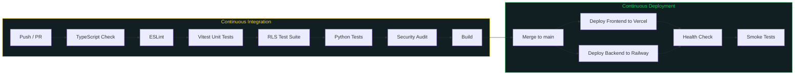

# hmnppl

> **An AI-first HR ERP Platform** — Let computers talk to computers. Let humans manage the human interactions.

<div align="center">

[](https://nextjs.org/)
[](https://www.typescriptlang.org/)
[](https://tailwindcss.com/)
[](https://www.python.org/)
[](https://fastapi.tiangolo.com/)
[](https://supabase.com/)

[]()
[]()
[]()
[]()
[]()
[]()

</div>

---

## Overview

The AI HR Platform is a multi-tenant SaaS HR ERP where autonomous AI agents handle administrative tasks — discipline, recruiting, onboarding, benefits, reviews, and coaching — so HR professionals can focus on people, not paperwork.

**Phase 1 delivers:** authentication, a marketing landing page, and the industry's first AI-powered employee discipline and counseling module, featuring a configurable policy engine that feeds company rules to AI agents for compliant, consistent HR execution.

> No competitor offers AI-powered discipline workflows. This is our market entry point and competitive moat.

## Architecture



## Technology Stack

| Layer           | Technology                            | Purpose                                 |
| --------------- | ------------------------------------- | --------------------------------------- |
| **Frontend**    | Next.js 15 App Router                 | SSR, RSC, API routes as BFF             |
| **Language**    | TypeScript 5.3 (strict)               | Type-safe frontend + shared schemas     |
| **Styling**     | Tailwind CSS 3.4 + shadcn/ui          | Dark premium theme, brand tokens        |
| **UI Showcase** | Aceternity UI + Framer Motion         | Animated landing page components        |
| **Charts**      | EvilCharts                            | Data visualizations                     |
| **State**       | TanStack Query + Zustand              | Server state + minimal client state     |
| **Forms**       | React Hook Form + Zod                 | Type-safe validation                    |
| **Rich Text**   | Tiptap 3                              | Track-changes document editing          |
| **Backend**     | Python FastAPI 0.110+                 | AI service on Railway                   |
| **Database**    | Supabase (PostgreSQL)                 | Auth, RLS, Storage, Edge Functions      |
| **AI Routing**  | OpenRouter + Hugging Face             | Model-agnostic, task-specific selection |
| **Testing**     | Vitest + Playwright + pytest          | Unit, E2E, Python service tests         |
| **CI/CD**       | GitHub Actions                        | Automated build, test, deploy           |
| **Hosting**     | Vercel (frontend) + Railway (backend) | Production deployment                   |

## Project Structure

```
human-resources-platform/
├── src/                          # Next.js frontend
│   ├── app/                      # App Router pages
│   │   ├── (marketing)/          # Public landing pages
│   │   ├── (auth)/               # Login / Signup
│   │   ├── (dashboard)/          # Authenticated app screens
│   │   ├── onboarding/           # Company setup wizard
│   │   └── api/v1/               # BFF API routes
│   ├── components/
│   │   ├── ui/                   # 27 shared UI primitives
│   │   ├── layout/               # Shell, Sidebar, Header
│   │   ├── landing/              # Marketing page sections
│   │   ├── auth/                 # Login/Signup forms
│   │   ├── onboarding/           # 5-step wizard steps
│   │   ├── domain/               # HR-specific components
│   │   ├── policy/               # Policy builder UI
│   │   ├── incidents/            # Incident forms & queue
│   │   ├── review/               # AI document review panels
│   │   ├── meetings/             # Meeting scheduler & summary
│   │   ├── documents/            # Document viewer & signing
│   │   └── signatures/           # E-signature canvas
│   ├── lib/
│   │   ├── supabase/             # DB client utilities
│   │   ├── auth/                 # RBAC, sessions, permissions
│   │   ├── services/             # Business logic services
│   │   ├── validations/          # Zod schemas
│   │   └── api/                  # Typed API client
│   ├── stores/                   # Zustand state stores
│   ├── hooks/                    # Custom React hooks
│   ├── config/                   # Navigation, feature flags
│   └── types/                    # TypeScript type definitions
├── server/                       # Python FastAPI AI service
│   ├── app/
│   │   ├── core/                 # Config, security, logging
│   │   ├── routers/              # API endpoints
│   │   ├── services/             # AI router, policy engine, PII
│   │   ├── prompts/              # LLM prompt templates
│   │   └── schemas/              # Pydantic models
│   └── tests/                    # Python test suite
├── supabase/
│   └── migrations/               # 21 versioned SQL migrations
├── tests/
│   ├── rls/                      # Cross-tenant isolation tests
│   └── e2e/                      # Playwright E2E tests
├── spikes/
│   ├── tiptap-editor/            # Rich text editor spike
│   ├── e-signature/              # E-signature legal feasibility
│   └── ai-evaluation/            # AI model evaluation & prompts
├── .github/workflows/
│   ├── ci.yml                    # CI pipeline
│   └── deploy.yml                # CD pipeline
└── ai_docs/ai-hr-platform/       # Product documentation
    ├── PRD.md                    # Product Requirements Document
    ├── REQUIREMENTS.md           # Requirements from stakeholder interview
    ├── TASKS.md                  # 48 build tasks across 6 waves
    ├── UI.md / UX.md             # Design specifications
    └── wave-{0-5}-checkpoint.md  # Session recovery checkpoints
```

## Build Progress

<div align="center">

| Wave      | Name                                     | Tasks     | Points      | Status      |
| --------- | ---------------------------------------- | --------- | ----------- | ----------- |
| 0         | Spikes & Scaffolding                     | 7/7       | 34          | ✅ Complete |
| 1         | Foundation (DB + Auth + Shell)           | 9/9       | 50          | ✅ Complete |
| 2         | Core Backend (Policies + Incidents + AI) | 8/8       | 40          | ✅ Complete |
| 3         | Core Frontend (Screens + Components)     | 8/8       | 44          | ✅ Complete |
| 4         | Integration & Edge Cases                 | 8/8       | 38          | ✅ Complete |
| 5         | Polish, Testing & Deploy                 | 8/8       | 41          | ✅ Complete |
| **Total** |                                          | **48/48** | **247/247** | **✅ 100%** |

</div>

### Dependency Graph



## Key Features

### Phase 1 — MVP

- **Multi-tenant authentication** — Email/password, Google SSO, Microsoft SSO with Supabase Auth
- **5-tier RBAC** — Super Admin, Company Admin, HR Agent, Manager, Employee
- **Configurable policy engine** — Visual rule builder with escalation ladders and conflict detection
- **AI-powered discipline workflows** — Incident submission → AI evaluation → document generation → HR review
- **Three-way meeting management** — Scheduling, AI-generated agendas, structured summaries
- **Custom e-signature engine** — Canvas drawing + typed signatures with SHA-256 tamper evidence
- **Progressive discipline tracking** — Automatic escalation based on employee history
- **Company onboarding wizard** — 5-step guided setup with AI policy templates
- **Role-adaptive dashboards** — Different views for each of the 5 user roles
- **Real-time notifications** — In-app notification bell with unread counts

### AI Pipeline



## Data Model



## Security & Compliance

<div align="center">

| Framework     | Status                        |
| ------------- | ----------------------------- |
| SOC 2 Type II | Design for compliance         |
| HIPAA         | BAA-ready architecture        |
| GDPR          | Data subject rights built in  |
| CCPA          | Opt-out + data disclosure     |
| EEOC          | AI bias monitoring from day 1 |
| WCAG 2.1 AA   | Accessibility audit complete  |

</div>

### Security Architecture

- **3-layer RBAC** — Middleware → API route → Database RLS
- **Row-Level Security** — On all 14 tables, verified by automated cross-tenant test suite
- **PII protection** — All PII stripped before AI calls (SSN, salary, address, email)
- **Audit logging** — DB triggers on 6 sensitive tables, append-only, 7-year retention
- **Content hashing** — SHA-256 on all signed documents for tamper evidence
- **Prompt injection defense** — Structured templates, no free-text concatenation
- **Circuit breaker** — AI service fails gracefully to manual mode

See [security-review.md](ai_docs/ai-hr-platform/security-review.md) for the full OWASP Top 10 + SOC 2 review.

## Getting Started

### Prerequisites

- Node.js 25.x
- Python 3.12+
- Supabase CLI
- Docker (for local Supabase)

### Frontend

```bash
# Install dependencies
npm install

# Set up environment variables
cp .env.example .env.local

# Run development server
npm run dev

# Build for production
npm run build

# Start production server
npm start
```

### Backend (Python AI Service)

```bash
cd server

# Create virtual environment
python -m venv .venv
source .venv/bin/activate  # or .venv\Scripts\activate on Windows

# Install dependencies
pip install -r requirements.txt

# Run development server
uvicorn app.main:app --reload

# Run tests
pytest
```

### Local Supabase

```bash
# Start local Supabase
supabase start

# Apply migrations
supabase db push

# Run RLS test suite
pytest tests/rls/
```

### Testing

```bash
# Unit tests (Vitest)
npm test

# Watch mode
npm run test:watch

# Coverage report
npm run test:coverage

# E2E tests (Playwright)
npx playwright test

# Lint
npm run lint

# Format
npm run format
```

## CI/CD Pipeline



## API Endpoints

| Domain         | Endpoints                                                                                            | Min Role           |
| -------------- | ---------------------------------------------------------------------------------------------------- | ------------------ |
| **Auth**       | `POST /register`, `POST /login`, `POST /logout`, `GET /session`, SSO flows                           | Public             |
| **Companies**  | `GET /me`, `PATCH /me`, `POST /onboarding`                                                           | employee           |
| **Users**      | `GET list`, `GET :id`, `POST invite`, `PATCH :id`, `GET :id/timeline`                                | manager            |
| **Policies**   | `GET list`, `GET :id`, `POST create`, `PUT update`, `PATCH toggle`                                   | company_admin      |
| **Incidents**  | `GET list`, `GET :id`, `POST create`, `PATCH :id/status`                                             | manager            |
| **Discipline** | `GET list`, `GET :id`, `POST review/:id`, `POST regenerate/:id`                                      | hr_agent           |
| **Meetings**   | `GET list`, `GET :id`, `POST create`, `PATCH :id`                                                    | hr_agent           |
| **Documents**  | `GET list`, `GET :id`, `POST generate`, `GET :id/pdf`                                                | hr_agent           |
| **Signatures** | `POST create`, `POST dispute/:id`                                                                    | employee           |
| **AI**         | `POST evaluate-incident`, `POST generate-document`, `POST generate-agenda`, `POST summarize-meeting` | hr_agent (proxied) |

## Design System

### Color Palette

<div align="center">

| Color           | Hex       | Usage                                    |
| --------------- | --------- | ---------------------------------------- |
| Dark Slate Grey | `#111e22` | Page background, sidebar                 |
| Slate Grey      | `#223d44` | Card background, elevated surfaces       |
| Vanilla Custard | `#ffd900` | Primary CTA, accent, links               |
| Honey Bronze    | `#db9224` | Secondary accent, badges, pending states |
| Brown Red       | `#c93638` | Alerts, medium severity                  |
| Night Bordeaux  | `#e21d24` | Danger, critical, destructive actions    |
| Success         | `#22c55e` | Completed actions, signed status         |

</div>

### Typography

- **Headings:** Playfair Display (serif)
- **Body:** System sans-serif

### Responsive Breakpoints

| Breakpoint | Width       | Sidebar         | Layout        |
| ---------- | ----------- | --------------- | ------------- |
| Desktop    | >= 1280px   | Expanded 240px  | Full grid     |
| Laptop     | 1024-1279px | Collapsed 64px  | Adapted grid  |
| Tablet     | 768-1023px  | Hidden (drawer) | Stacked       |
| Mobile     | < 768px     | Hidden (drawer) | Single column |

## Key Metrics & Targets

| Metric                       | Target           | Current                |
| ---------------------------- | ---------------- | ---------------------- |
| Disciplinary processing time | < 48 hours       | Industry avg: 5-7 days |
| AI document approval rate    | > 80% unmodified | TBD                    |
| Manager adoption rate        | > 70% monthly    | TBD                    |
| Employee signature speed     | > 90% within 24h | TBD                    |
| Platform uptime              | 99.9%            | TBD                    |
| Landing page conversion      | >= 3%            | TBD                    |

## Documentation

| Document                                                             | Description                                              |
| -------------------------------------------------------------------- | -------------------------------------------------------- |
| [PRD](ai_docs/ai-hr-platform/PRD.md)                                 | Product Requirements Document (Approved, 95% confidence) |
| [Requirements](ai_docs/ai-hr-platform/REQUIREMENTS.md)               | Stakeholder interview requirements                       |
| [Tasks](ai_docs/ai-hr-platform/TASKS.md)                             | 48 build tasks across 6 waves                            |
| [UI Specs](ai_docs/ai-hr-platform/UI.md)                             | Screen-by-screen design specifications                   |
| [UX Flows](ai_docs/ai-hr-platform/UX.md)                             | User flows and interaction patterns                      |
| [Security Review](ai_docs/ai-hr-platform/security-review.md)         | OWASP Top 10 + SOC 2 audit                               |
| [Accessibility Audit](ai_docs/ai-hr-platform/accessibility-audit.md) | WCAG 2.1 AA compliance checklist                         |
| [Wave Checkpoints](ai_docs/ai-hr-platform/)                          | Session recovery checkpoints (0-5)                       |

## Remaining TODOs

| ID       | Action                                             | Priority |
| -------- | -------------------------------------------------- | -------- |
| SEC-007  | Implement CSRF tokens for state-changing mutations | High     |
| SEC-008  | Add rate limiting to auth endpoints                | High     |
| SEC-011  | Penetration testing by third-party                 | High     |
| AI-007   | Connect frontend mock data to real API calls       | Medium   |
| PERF-001 | Add React Server Components for data-heavy pages   | Medium   |
| TEST-001 | Install Playwright and run E2E tests               | Medium   |

## License

Private — All rights reserved.
